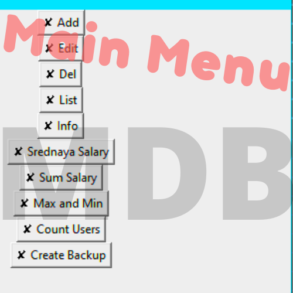

MDB

Обработка базы данных MongoDB через графический интерфейс.

Используемые модули: pymongo, tkinter

Установка:
1. Распаковать архив.
2. Установить MongoDB Compass.
3. Установить используемые модули (pip).
4. Открыть файл config.py
5. Заполнить по инструкции.
6. Запустить файл main.py
Программа готова к работе!
